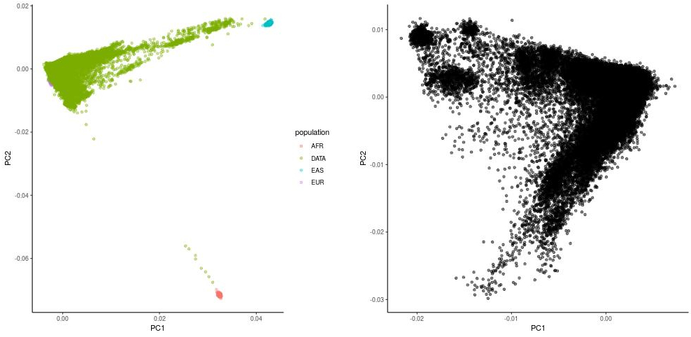
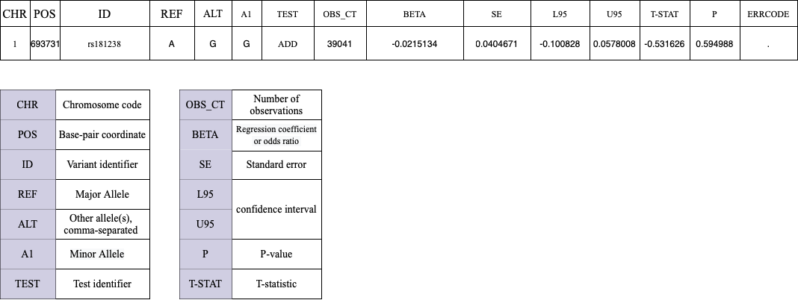
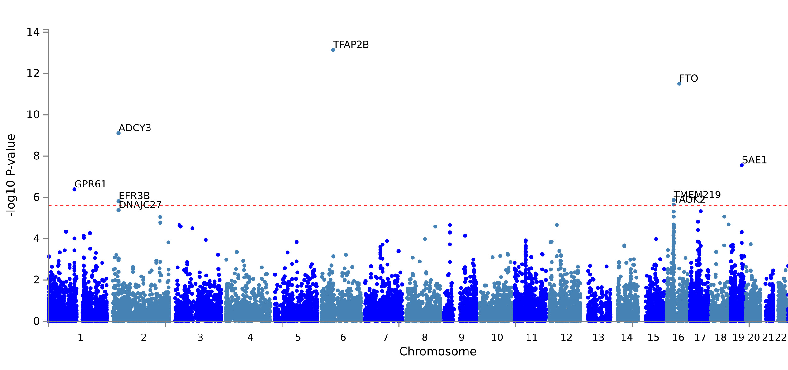
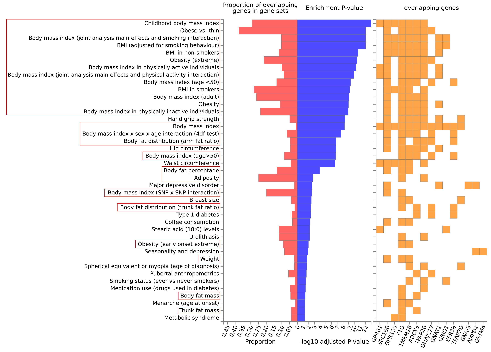

# Genome-wide association study (GWAS) and construction of polygenic risk scores (PRS) for height and weight

### Authors:
- Mark Zorin
- Dmitrii Iliushchenko
- Alexander Rakitko (Supervisor)

## Environment
- MacOS Monterey 12.4 (M1 support) or Ubuntu 20.4 
- [R-4.2.0](https://www.r-project.org)
- [plink v1.9](https://www.cog-genomics.org/plink/)
- [PRIMUS v1.9](https://primus.gs.washington.edu/primusweb/index.html)
- [beagle 5.1](https://faculty.washington.edu/browning/beagle/beagle.html)

## Introduction

Genome-wide association study (GWAS) is a study of a genome-wide set of genetic variants in different individuals to see if any variant is associated with a morphologycal characteristics or other humant traits. In our study, we analyzed the genetic variants of a large cohort of Russians to identify single nucleotide polymorphisms (SNPs) with significant associations of changes in body mass index and the computing a polygenic risk scores (PRS). GWAS analysis includes several steps of quality control (QC), population stratification, as well as the conduct of the GWAS analysis itself. At the end, the calculation of the PRS based on the statistics of the GWAS will be analyzed. All steps of QC and steps visualization were based on [Marees et al. 2018](https://www.ncbi.nlm.nih.gov/pmc/articles/PMC6001694/)

### Main tasks

  1. Analyze papers about GWAS and PRS
  2. Perform data QC and study a population stratification
  3. Run GWAS on simulated data, train PRS
  4. Prepare GWAS protocole and pass it on to Genotek employees
  5. Analyze summary GWAS statistics of real data

## Data availability
The data is precented by 39041 people from the Russian cohort, gentified using the Illumina Infinium Global Screening Array (GSA) v1.0 / v2.0 / v3.0 provided by Genotek. Scan images processing and genotypes calling were performed using GenomeStudio v2.0. Since the Genotek data cannot be provided to third parties, we recommend using [simulated data](https://github.com/MareesAT/GWA_tutorial/blob/master/1_QC_GWAS.zip/) for all steps (files with .bam , .fam and bim format). 

## Structure of Data
See below for a description of the formats `.ped` and `.map`. For further work  these files must be converted to `.bam`,`.fam`,`.bim` with plink. In the [tutorial](https://github.com/MareesAT/GWA_tutorial/blob/master/), data is already given in recoded format.


## Quality control


Before we start make sure you have [plink](https://www.cog-genomics.org/plink/)  and [R](https://www.r-project.org) installed.

1. Filtering samples and positions (SNP) by call rate
  
   First step is filtering positions and samples that are missing in a large proportion of the subjects
   
   a. Removal of SNPs with missingness of genotype in more than 20\% cases
   ```
   plink --bfile raw_file --geno 0.2 --make-bed --out file_1
   ```
   b. Removal of individuals with missingness of genotype in more than 20\%  cases
   ```
   plink --bfile file_1 --mind 0.2 --make-bed --out file_2
   ```
   c. Removal of SNPs with missingness of genotype in more than 2\% cases
   ```
   plink --bfile file_2 --geno 0.02 --make-bed --out file_3
   ```
   d. Removal of individuals with missingness of genotype in more than 2\%  cases
   ```
   plink --bfile file_3 --mind 0.02 --make-bed --out file_4
   ```
   
2. Filtering samples with a discrepancy between the genetic sex and the sex indicated in the personal data

   Subjects who were a priori determined as females must have a F value of <0.2, and subjects who were a priori determined as males must have a F value >0.8. This F value is based on the X chromosome inbreeding (homozygosity) estimate. 
   
   a. Mark subjects who do not fulfil these requirements as "PROBLEM"
   ```
   plink --bfile file_4 --check-sex 
   ```
   b. Filter samples
   ```
   plink --bfile file_4 --impute-sex --make-bed --out file_5
   ```
   
3. Heterozygosity check
   
   Excluding samples in which the observed heterozygosity deviated by more than 3 standard deviations from the sample mean. Heterozygosity was assessed for the cohort after filtering genetic variants in linkage disequilibrium (search window - 50 SNPs, number of SNPs for window shift at the end of the step - 5, r2 between SNPs < 0.2)
   
   a. Generate a list of independent SNP
   ```
   plink --bfile file_5 --exclude high_inversion_regions.txt --range --indep-pairwise 50 5 0.2 --out independent_SNP
   ```
   b. Generate file contains your pruned data set
   ```
   plink --bfile file_5 --extract independent_SNP.prune.in --het --out R_check
   ```
   c. Generate a list of individuals who deviate more than 3 standard deviations from the heterozygosity rate mean
   We recommend using this [script](https://github.com/MareesAT/GWA_tutorial/) that have name `heterozygosity_outliers_list.R` in archive 1_QC_GWAS.zip
   ```
   Rscript --no-save heterozygosity_outliers_list.R
   ```
   d. Adapt output file to make it compatible for PLINK, by removing all quotation marks from the file and selecting only the first two columns    
   ```
   sed 's/"// g' fail-het-qc.txt | awk '{print$1, $2}'> het_fail_ind.txt
   ```
   e. Remove heterozygosity rate outliers
   ```
   plink --bfile file_5 --remove het_fail_ind.txt --make-bed --out file_6
   ```   
4. Imputing

   Imputing is based on the procedure for determining the human genotype in positions that are not represented on the microchip, based on linkage disequilibrium. The cohort was imputed using the [beagle 5.1](https://faculty.washington.edu/browning/beagle/beagle.html) program with two reference panels: [1000Genomes](https://www.internationalgenome.org/) and [Haplotype Reference Consortium](http://www.haplotype-reference-consortium.org/participating-cohorts). In the subsequent analysis, positions were used that received a high imputing quality metric DR2 < 0.7. Multi-allelic substitutions were excluded from ongoing analyses.

5. Remove positions on sex chromosomes and mitochondria
   
   a.  Select autosomal SNPs only
   ```
   awk '{ if ($1 >= 1 && $1 <= 22) print $2 }' file_6.bim > snp_1_22.txt
   ```
   b. Extract them from our **file6**
   ```
   plink --bfile file_6 --extract snp_1_22.txt --make-bed --out file_7
   ```
 
6. MAF filtering

   Filtering out of positions based on minor allele frequency (MAF), while SNP with low MAF often associated with genotyping errors. Threshold depends on number of positions contained in data, in our case we will use **threshold 0.01**
   a. Remove SNPs with a low MAF frequency
   ```
   plink --bfile file_7 --maf 0.01 --make-bed --out file_8
   ```
   
 7. Hardy–Weinberg equilibrium
 
    Filtering of positions with inclination of the Hardy-Weinberg equilibrium: positions with a significant difference between the observed genotype frequencies and those expected according to the exact Hardy-Weinberg test (p-value < 1e-05) were removed.
    
    ```
    plink --bfile file_8 --hwe 1e-5 --make-bed --out file_9
    ```
 8. Relatedness
    
    Identification of close relatives individuals was carried out using the [PRIMUS](https://primus.gs.washington.edu/primusweb/res/documentation.html) program (Rapid Reconstruction of Pedigrees from Genome-wide Estimates of Identity by Descent). Pairs with PI_HAT > 0.15 were considered relatives. With the help of PRIMUS, we can obtain dataset, consisting of pairwise unrelated individuals.
    
## Popilation Stratification

  Before proceeding GWAS analysis you should consider a population stratification of yours data. We used MultiDimensional Scaling algorithm (MDS) to reduce dimentions of the studied cohort which was conmined with samples from the 1000Genomes dataset (EAS, AFR, EUR). We used an common position for both datasets with filtration with linkage filtering (search window - 50 SNPs, number of SNPs to shift the window at the end of the step - 5, r2 between SNPs < 0.2). We performed clustering based on first and secound component using [DBSCAN](https://scikit-learn.org/stable/modules/generated/sklearn.cluster.DBSCAN.html) algoritm. The samples which are not included in the clusters were excluded. Then we apply MDS algorithm again, but without merging sapmles with the 1000Genomes dataset. We selected the first 15 components to be used as covariates in the GWAS analysis.
  
  On the left figure you can see population stratification of our samples combined with 1000Genomes dataset. The right figure shows the MDS plot after sample filtering and without 1000Genomes data.
  
  

## GWAS

  In GWAS analysis used patients age, sex and 15 MDS component as a covariants. 39041 samples were included in analysis. We used a linear or logistic regression model depending on the phenotype of the patients. The results were annotated using the SnpEff 4.3t database, taking into account genetic variants that are in linkage disequilibrium with a significant SNP.
  
  To investigate an quantitative outcome measurement you should use a linear regression model
  
   ```
   plink --bfile file_9 --covar mds_components_file.txt --linear --out gwas_linear_results
   ```
     
  In case of qualitative measurement of the outcome, you should use a logistic regression model:
  
   ```
   plink --bfile file_9 --covar mds_components_file.txt --logistic --out gwas_logistic_results
   ```

  After finishing GWAS analysis, you will receive a 15-column file with summary of GWAS statistics data. 
  

  
  After receiving GWAS summary data file you can proceed to data visualization. We recommend using a [FUMA](https://fuma.ctglab.nl/) software to functional mapping and annotation of results. FUMA requires only 8 columns from GWAS summary file: chromosome number, SNP position, rs ID, p-value, effect allele (A1), non-effect allele, T-STAT, beta and SE. You can filter your raw summary file with simple command line tool ```cut -f```. FUMA accepts files smaller than 600 Mb, if your target file are bigger, please, compress it with ```gzip``` tool. Before run insert all paremeters for lead and candidate SNPs, based on your data, which includes: sample size, p-value tresshold for lead SNP, p-value cutoff, r$^{2}$ tresshold to define independant significant SNP, MAF and some others.
    
## Results 
  In our study, we found 17 leading SNPs that significantly correlated with changes in body mass index. On the manhattan plot you can see our main findings.  


Top 10 lead SNP (by p-value) placed in a separate table:

| rs ID | Gene | Chromosome | Position | p-value |
|:-----:|:----:|:----------:|:--------:|:-------:|
| rs71863246 | FTO | 16 | 53812770 | 3.31807e-32 |
| rs13022164 | TMEM18 | 2 | 632536 | 7.5091e-23 |
| rs68191244 | RNU4-17P | 18 | 57733386 | 2.17541e-16 |
| rs72892910 | TFAP2B | 6 | 50816887 | 6.8864e-15 |
| rs539515 | SEC16B | 1 | 177889025 | 4.92406e-12 |
| rs34643430 | CPNE8 | 12 | 39440653 | 8.24194e-12 |
| rs144582188 | PRDX4P1 | 4 | 45165650 | 1.89873e-11 |
| rs62104180 | ALKAL2 | 2 | 466003 | 3.16951e-11 |
| rs10876551 | EFR3B | 12| 39542943 | 1.23454e-10 |
| rs6749422 | ADCY3 | 2 | 25150011 | 1.76053e-10 |

  Previously, 14 SNPs have been shown to be associated with changes in BMI, but we found 3 SNPs that are not associated with BMI, according to Varsome, the GWAS catalog, and the NCBI SNP databases.
  
| rs ID | Gene | Chromosome | Position | p-value |
|:-----:|:----:|:----------:|:--------:|:-------:|
| rs34643430 | CPNE8 | 12 | 39440653 | 8.24194e-12 |
| rs62095984 | RP11-795H16.3 | 18 | 57771877 | 1.41311e-09 |
| rs7957068 | VWF | 12 | 6163378 | 2.50759e-08 |

## Gene Based Test

A gene-based approach considers association between a trait and all SNP within a gene rather than each marker individually. Gene based test is assigning SNP to the genes obtained from Ensembl build 85. Genome-wide significance (red dashed line) was set at 0.05 / N of genes. This test was also performed using FUMA. At the picture below we can see top 9 gene asociations.


## Gene sets
To perfom gene sets analysis we used GENE2FUNC tab in FUMA web site. Gene sets analysis takes into account the “scores” (in our case p-values) of all mapped genes and carries out a test of the relationship between a gene sets and the genetic associations of genes with a phenotype [Leeuw A et al 2016](https://www.nature.com/articles/nrg.2016.29). The picture below shows that the analysis identified 15 top genes with the highest p-values, which were obtained in a gene-based test and combined into one, already presented in MsigDB, WikiPathways databases, gene set. Next, we can see that most of our genes are associated with phenotypes such as obesity, body mass index, etc. All phenotypes highlighted in red boxes can be connected height and weight in our data.


## Conclusion and further plans

The analysis of GWAS showed significant SNPs that were already associated with body mass index, obesity, and height. At the same time, 3 SNPs were found that were not annotated and associated with height and weight.

In future plans, we are going to use the GWAS data to build polygenic risk scores using the PRSIСE-2 program.

## Literature

Andries T. Marees,corresponding author, Hilde de Kluiver, Sven Stringer, Florence Vorspan, Emmanuel Curis, Cynthia Marie‐Claire and Eske M. Derks. A tutorial on conducting genome‐wide association studies: Quality control and statistical analysis. Int J Methods Psychiatr Res. 2018;27:e1608.

de Leeuw CA, Mooij JM, Heskes T, Posthuma D (2015). MAGMA: Generalized Gene-Set Analysis of GWAS Data. PLoS Comput Biol 11(4): e1004219

Jimmy Z. Liu, Allan F. Mcrae, et al. A Versatile Gene-Based Test for Genome-wide Association Studies. The American Journal of Human Genetics 87, 139–145, 2010

Christiaan A. de Leeuw, Benjamin M. Neale, Tom Heskes and Danielle Posthuma. The statistical properties of gene-set analysis. Nature Reviews Genetics (2016). vol.17, 353-364.
